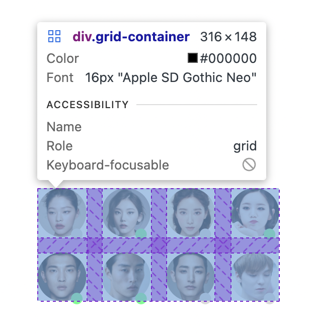
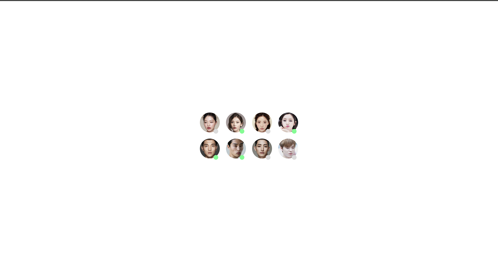
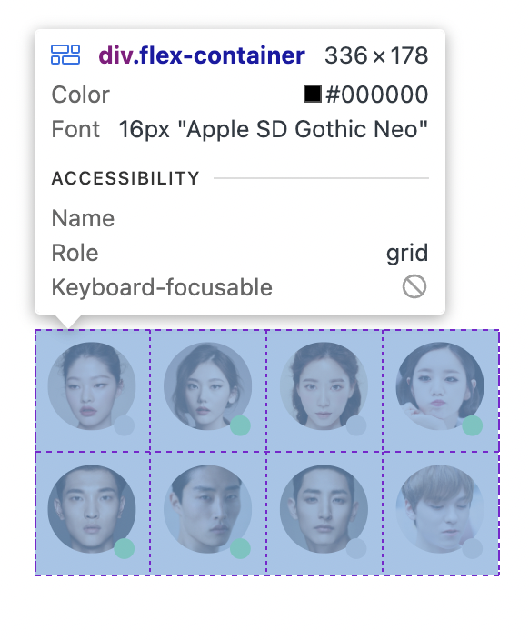
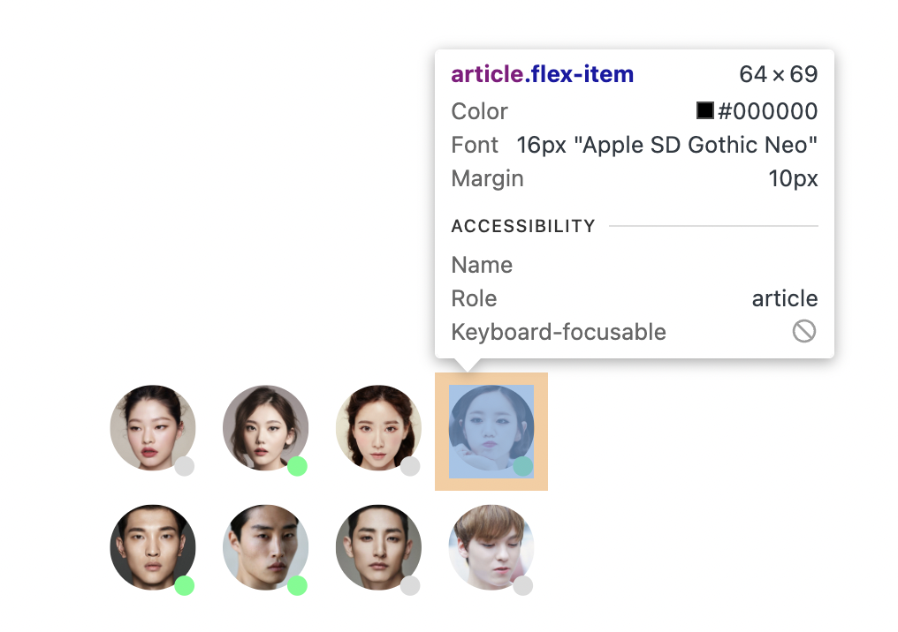
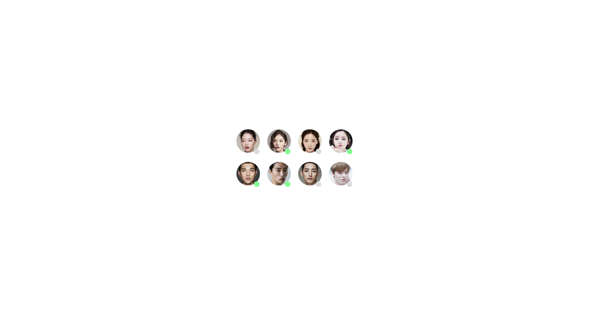

# 명재휘 과제 2 저장소 Avatars 입니다.

## 과제 1 📌

float 를 이용하여 레이아웃을 구현하라

### 레이아웃 요소

1. grid 의 gap 속성을 이용해 이미지 간격을 20px로 고정했습니다.
2. float를 오른쪽으로 주어 활동상태 요소를 오른쪽에 오도록 지정랬습니다.
3. 활동 상태 요소의 margin을 이용해 세부 조정을 했습니다.

### 접근성

1. 이미지의 alt 속성을 이용해 스크린 리더기가 읽을 수 있도록 설명을 적었습니다.
2. sr-only를 이용해 화면에는 표시되지 않지만 해당 컨텐츠의 제목을 작성했습니다.
3. 시맨틱태그를 사용해 접근성을 향상시켰습니다.
4. div혹은 span 태그를 사용할 때에는 role/label 속성을 추가했습니다.

### 성능

1. jpg를 webp로 변환해 성능을 향상시켰습니다.

### 최종 결과

   

## 과제 2 📌

flex를 이용해 레이아웃을 구현하라

### 레이아웃 요소

1. 이미지 픽셀이 고정되어 있기 때문에 flex 요소의 width값을 고정했습니다. (이미지 64 + 이미지 사이의 거리 20) \* 4
2. 범위를 벗어나는 요소들은 줄바꿈 처리 했습니다.
3. 활동상태 요소를 오른쪽 하단에 두어 디자인을 만들었습니다.
4. 이미지 사이의 마진을 10px씩 주어 20px 이 떨어지도록 했습니다.

레이아웃

이미지

### 접근성

위와 동일합니다.

### 성능

위와 동일합니다.

### 최종 결과

