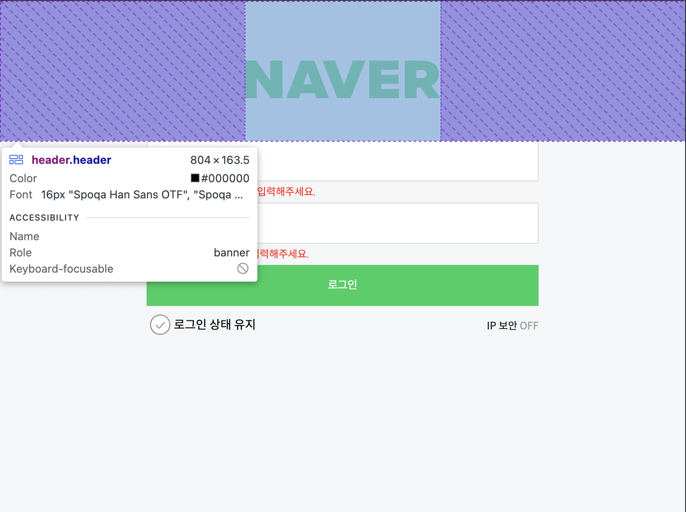
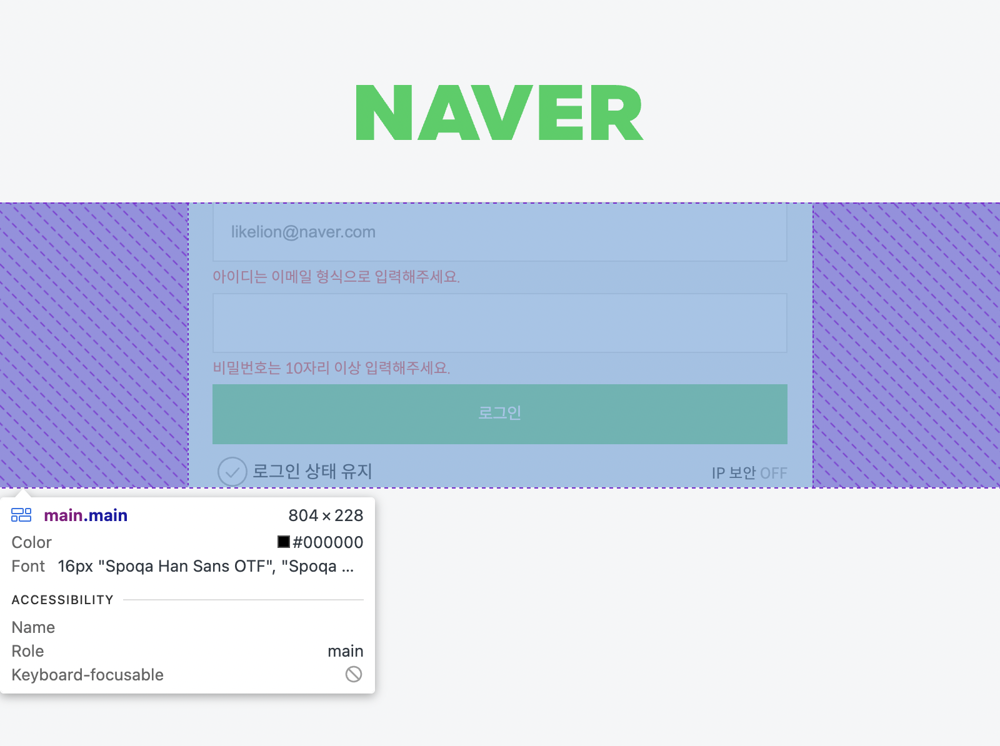
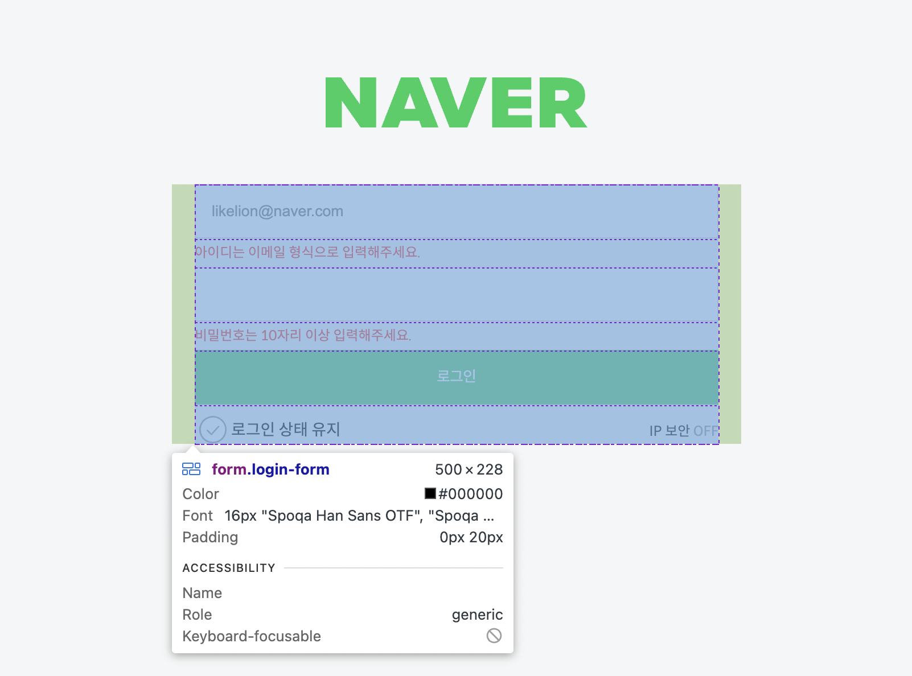
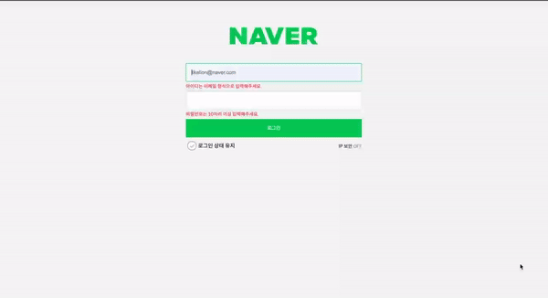
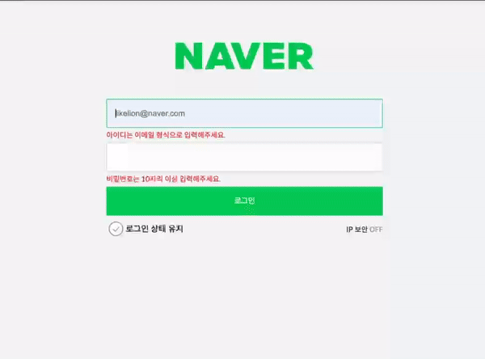
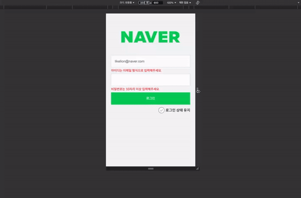

# 과제. 네이버 로그인 폼 구현 ✅

👉 
<a href="https://myeong-jae-hwi.github.io/homework/login/login.html" target="_blank">
링크 바로가기
</a>

## 목차📌
1. [문제](#문제-)
2. [레이아웃](#레이아웃)
3. [마크 다운](#마크-다운)
4. [웹 접근성](#웹-접근성)
5. [반응형](#반응형)
6. [회고](#회고)

### 문제 📝

반응형 레이아웃을 구현하라. 이 때 모든 요소는 탭으로 접근할 수 있어야 하며, 폼 유효성 검사도 수행해야 함.

### 레이아웃

|                                **헤더**                                |                                  **메인**                                   |                                **로그인폼**                                |
| :--------------------------------------------------------------------: | :-------------------------------------------------------------------------: | :------------------------------------------------------------------------: |
|  |  |  |

### 마크 다운

HTML

```html
<!-- ============== 이메일 ============== -->
<form action="/" class="login-form">
  <input class="login-form__input" type="email" required placeholder="likelion@naver.com" />
  <label for="login-form__input" class="sr-only">email 입력 폼</label>

  <!-- ============== 에러메세지 ============== -->

  <div class="error-container">
    <p class="login-form_error">아이디는 이메일 형식으로 입력해주세요.</p>
  </div>

  <!-- ============== pw ============== -->

  <input class="login-form__input" type="password" pattern=".{10,}" required />
  <label for="login-form__input" class="sr-only">비밀번호 입력 폼</label>

  <!-- ============== 에러메세지 ============== -->

  <div class="error-container">
    <p class="login-form_error">비밀번호는 10자리 이상 입력해주세요.</p>
  </div>

  <!-- ============== 버튼 ============== -->

  <button class="login-form__btn" type="submit">로그인</button>
  <label for="login-form__btn" class="sr-only">로그인 버튼</label>

  <!-- ============== 체크박스 ============== -->
  <div class="checkbox-container">
    <label class="checkbox_label">
      <input type="checkbox" />
      <span class="checkbox_icon" tabindex="0"></span>
      <span class="checkbox_text">로그인 상태 유지</span>
    </label>
    <span class="ipsec">
      <a href="./pages/ip_security.html" target="_blank">
        IP 보안
        <span id="ip__state">OFF</span>
      </a>
    </span>
  </div>
</form>
```

### 웹 접근성

1. header, main 등 시맨틱한 태그 사용

2. 로고 부분을 h1태그로 제목임을 알 수 있게 했고 sr-only를 이용해 디자인적으로 제거

```html
<h1 class="sr-only">네이버 로그인 폼</h1>
<div class="logo">
  
</div>
```

3. 커스텀한 체크박스에 tabindex 속성 부여

```html
<span class="checkbox_icon" tabindex="0"></span>
```

<p align="center">
  
</p>

4. 폼 유효성 검사 추가

```css
input:invalid ~ .error-container .login-form_error,
input:invalid + .error-container .login-form_error {
  display: block;
}
```

<p align="center">
  
</p>

### 반응형

<p align="center">
  
</p>

1. 가로 크기가 768px이 넘어가면 폼 크기를 500px로 고정했습니다.
3. 모바일 환경에서 보이지 않던 IP 보안 스위치을 데스크탑에서는 보이도록 설정했습니다.
4. input박스를 화면이 늘어남에 따라 같이 늘어나도록 설정했습니다.

### 회고

> 이번 과제를 하며 내가 가장 초점을 맞췄던 건 반응형도, 웹 접근성도 아닌 <b>변수 명<b>이었다. 나는 그동안 변수명을 정말 대충 지어왔다. 심지어 css같은 경우에는 순서조차 뒤죽박죽으로 만들곤 했었다. 그래서 항상 번거롭게 파일을 왔다갔다 하며 변수명을 찾았었는데 시간도 많이 소요되고 무엇보다 효율성이 너무 떨어졌다.
>
> 당시에는 변수명을 짓는 패턴이 있다는 것도 몰랐었고, 무엇보다 이름 생각할 시간에 차라리 코드 한 줄 더짜지 라는 생각을 가지고 있었던 것 같다. 결국에는 오히려 소요 시간만 늘어났고 나중에는 코드를 읽기도 어려웠던 기억이 있어 이번 과제를 하며 최대한 변수명에 신경쓰자는 마음으로 과제를 시작했다.
>
> 과제를 진행하며 확실히 변수명으로 인해 파일을 왔다갔다 하던 일이 줄었다. 해당 요소가 어떤 컨테이너 안에 있는지조차 알 수 있으니 코드 짜기가 한 결 쉬워졌다. 또 잘 활용은 못한것 같지만 css 중첩도 시도해 봤는데 이전에 알고있던 방식보다 가독성이 더 좋아진 것 같아 뿌듯했다.
